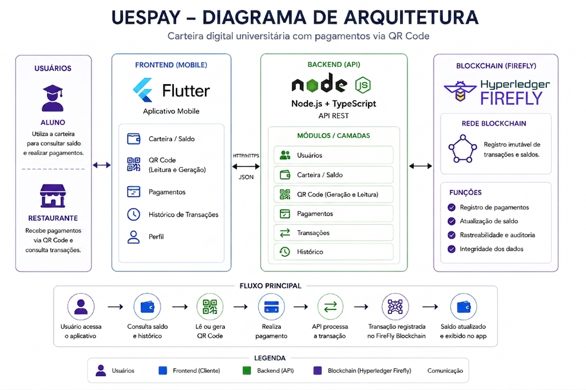

# UesPay

Sistema de carteira digital universitária para modernização do acesso e pagamento de serviços dentro da universidade, com foco inicial no Restaurante Universitário (RU) da UESPI.

---

## Sobre o Projeto

O **UesPay** é uma plataforma digital baseada em blockchain desenvolvida para facilitar pagamentos de serviços universitários utilizando créditos digitais (tokens). O projeto busca substituir métodos tradicionais, como fichas físicas e pagamentos presenciais, por uma solução moderna, prática e segura.

### Funcionalidades do MVP

- Consulta de saldo.
- Atualização de saldo
- Histórico de transações
- Pagamento digital (refeição no RU via QR Code)
- Transferência de valores
- Processamento de QR Code

---

## Tecnologias

| Camada | Tecnologia |
|--------|-----------|
| **Frontend** | Flutter |
| **Backend** | TypeScript, Express, Node.js |
| **Blockchain** | Hyperledger FireFly |

---

## Pré-requisitos

Antes de rodar o projeto, certifique-se de ter instalado:

- [Node.js](https://nodejs.org/) (v18 ou superior)
- [Flutter SDK](https://docs.flutter.dev/get-started/install) (v3.0 ou superior)
- [Android Studio / Emulador Android](https://developer.android.com/studio)
- [Hyperledger FireFly CLI](https://hyperledger.github.io/firefly/latest/gettingstarted/) (para o sandbox local de blockchain)

---

## Como rodar o projeto

### 1. Clonar o repositório

```bash
git clone https://github.com/les-prp-uespi/uespay.git
cd uespay
```

### 2. Instalar dependências do backend

```bash
cd backend
npm install
```

### 3. Configurar variáveis de ambiente

Copie o arquivo de exemplo e ajuste se necessário:

```bash
cp .env.example .env
```

> Os comandos a seguir devem ser executados dentro da pasta `backend/`.

As variáveis padrão já vêm configuradas para o ambiente local:

| Variável | Valor padrão | Descrição |
|----------|-------------|-----------|
| `PORT` | `3000` | Porta do servidor Express |
| `FIREFLY_URL` | `http://localhost:5000` | URL do sandbox local do FireFly |
| `FIREFLY_NAMESPACE` | `default` | Namespace do FireFly |

### 4. Iniciar o FireFly (blockchain)

Se for a **primeira vez**, crie a stack:

```bash
ff init uespay 1
```

Depois, inicie a stack:

```bash
ff start uespay
```

> O painel da blockchain fica disponível em `http://localhost:5109`.

### 5. Iniciar o servidor

```bash
npm run dev
```
O servidor sobe na porta 3000. 
**Dica:** A documentação completa da API (Swagger) está disponível em `http://localhost:3000/api-docs`.

---

## Como rodar o projeto (Frontend Flutter)

O aplicativo móvel está localizado dentro da pasta `app_uespay/app_uespay`.

### 1. Instalar dependências do aplicativo

Abra um novo terminal e navegue para a pasta do Flutter:
```bash
cd app_uespay/app_uespay
flutter pub get
```

### 2. Executar no Emulador ou Dispositivo Físico

Com o emulador Android aberto, rode o aplicativo:

```bash
flutter run
```

---

## Estrutura do Projeto

```
uespay/
├── app_uespay/                    # App Mobile em Flutter (MVP 100% Integrado)
│   └── app_uespay/
│       ├── android/
│       ├── ios/
│       ├── lib/
│       │   ├── assets/            # Imagens e ícones
│       │   ├── conexao_backend/   # Lógica de componentes
│       │   ├── telas/             # Telas do fluxo (Home, QR Code, Sucesso)
│       │   └── main.dart          # Entrypoint do App e Scanner Principal
│       └── pubspec.yaml
├── backend/                       # API Node.js + Express
│   ├── src/
│   │   ├── data/                  # Dados simulados (users)
│   │   ├── routes/                # Definição dos endpoints REST
│   │   ├── services/              # Regras de Negócio e integração FireFly
│   │   └── server.ts              # Entrypoint da API e Swagger Docs
│   └── package.json
└── README.md
```

---

## Arquitetura da Solução
<p align="center">
  
</p>

## Equipe

- Maria Rita Lustosa da Silva Nascimento
- Pedro Gabryel Araújo do Nascimento
- Filipe Costa Barbosa
- Juliana Mendes de Carvalho

### Orientador
- Alcemir Rodrigues Santos
